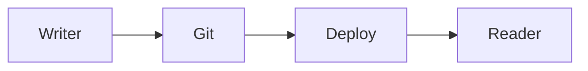

# dmix writes

A local, Git-backed MDX publication built with the Next.js App Router.

## Write a post

Create `content/blog/your-slug.mdx` with the required frontmatter:

```mdx
---
title: "Your title"
date: "2026-08-26"
summary: "One concise description."
tags: ["topic", "another-topic"]
draft: false
---

Write in Markdown or MDX here.
```

`draft: true` excludes a post from the site, RSS feed, tags, and static routes.

## Images and diagrams

Place local images in `public/blog/`, then use standard Markdown in a post:

```md

```

Mermaid diagrams render on the reader's device. Add a `mermaid` code block:

````md

````

## Run locally

```bash
npm install
npm run dev
```

Set `NEXT_PUBLIC_SITE_URL` in your deployment environment to your canonical domain. It is used for RSS links and metadata.
