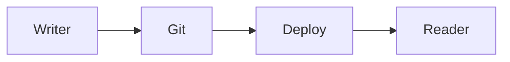

# dmix writes

A local, Git-backed MDX publication built with the Next.js App Router.

## Write a post

Create `content/blog/your-slug.mdx` with the required frontmatter:

```mdx
---
title: "Your title"
date: "2026-08-26"
updated: "2026-09-01"
summary: "One concise description."
tags: ["topic", "another-topic"]
draft: false
---

Write in Markdown or MDX here.
```

`draft: true` excludes a post from the site, RSS feed, tags, and static routes. `updated` is
optional and drives `<lastmod>` in the sitemap, `dateModified` in JSON-LD, and RSS `lastBuildDate`.

## Images and diagrams

Place local images in `public/blog/`, then use standard Markdown in a post:

```md

```

Every post image renders inside a zero-CLS `media-frame` that reserves its exact layout box
via `aspect-ratio` before the image downloads, with a low-quality placeholder shown while
loading. The first image in a post is treated as the hero (loaded eagerly with high priority);
all others load lazily.

When adding an image:

1. Add its intrinsic dimensions to the map in `lib/images.ts` (`sips -g pixelWidth -g pixelHeight public/blog/your-image.png`).
2. Generate its placeholder with `./scripts/generate-lqip.sh` (needs 48px-wide JPEG output in `public/lqip/`).

Mermaid diagrams render on the reader's device. Add a `mermaid` code block:

````md

````

## Run locally

```bash
npm install
npm run dev
```

Set `SITE_URL` in your deployment environment to your canonical domain (defaults to
`https://blog.dharmikshinde.tech`). It is used for canonical tags, RSS links, sitemap, metadata,
and `/llms.txt`.
